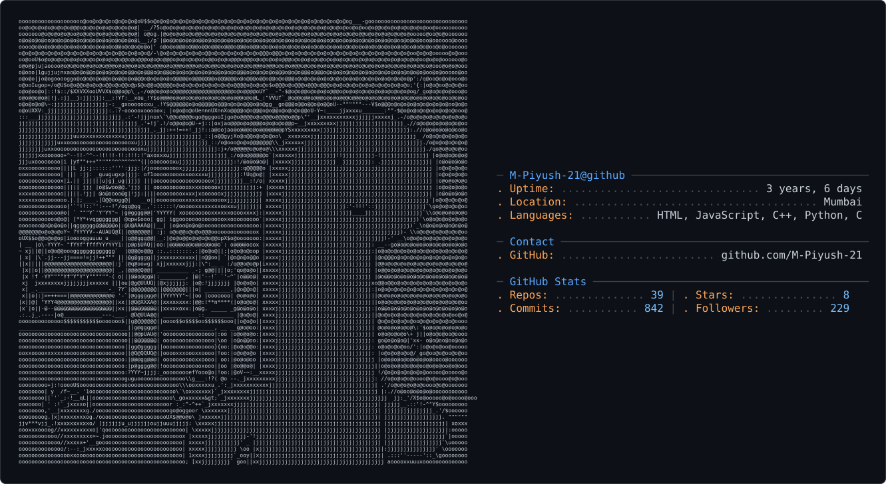

---

<h3><code>piyush@github ~ $ ./contributions.sh</code></h3>

<b>365 days of code, creativity, and continuous learning.</b>

<!-- Animated contribution heatmap generated by GitHub Actions -->

---

<picture>
  <source media="(prefers-color-scheme: dark)" srcset="dark_mode.svg"/>
  <source media="(prefers-color-scheme: light)" srcset="light_mode.svg"/>
  
</picture>

<h3>Software Development Engineer • Full Stack Developer • Product Designer • AI Enthusiast</h3>

Building scalable web applications, AI-powered products, modern user experiences, and enterprise solutions.

# 🚀 About Me

- 💼 Software Development Engineer with hands-on industry experience.
- 🚀 Building scalable applications with MERN and Next.js.
- 🤖 Passionate about AI-powered products, intelligent automation, and AI agents.
- 🎨 Strong interest in product design, UI/UX, and interactive experiences.
- 🌱 Currently exploring system design, cloud infrastructure, and AI agents.
- 📫 **Email:** [mahajanpi2105@gmail.com](mailto:mahajanpi2105@gmail.com)

 

---

# 💼 Professional Experience

## Software Development Engineer — Arustu Technology

- Developed and improved enterprise web applications.
- Contributed to migration of legacy applications to Next.js.
- Worked with REST APIs and full-stack architecture.
- Contributed to AI workflows and modern UI/UX implementation.
- Built responsive interfaces using React and the MERN stack.

## IT Lead Supervisor — Code n Creative

- Supervise IT operations and digital product workflows.
- Coordinate technical execution and cross-functional teams.
- Support business systems, integrations, and process optimization.
- Contribute to product delivery and technology improvements.

---

# 🚀 Featured Projects

### 🤖 Markzy AI

AI-powered marketing platform designed to help businesses create and manage marketing workflows.

- 100+ AI-powered marketing tools.
- Personalized AI engine based on business context.
- AI integrations and intelligent content workflows.
- Built using the MERN stack.

### 📊 North Light Analytics

Analytics platform focused on event comparison, reporting, and pricing intelligence.

- Contributed to migration from a legacy Python application to Next.js.
- Developed event comparison and event library features.
- Built reporting and business intelligence interfaces.
- Worked on AI-assisted insights and pricing optimization.

### 🔮 AstroCall

Digital astrology platform combining astrology services with modern technology.

- Astrology platform and dashboard development.
- AI-assisted name suggestions.
- Mobile app UI/UX and product interface design.
- SEO and product experience improvements.

### 🛰️ Satellite Change Detection

Computer vision project exploring satellite imagery and building change detection.

- Worked with the SpaceNet 7 building dataset.
- Explored image preprocessing and geospatial labels.
- Applied deep learning concepts to satellite imagery.
- Used Python and TensorFlow for model experimentation.

---

# 💻 Tech Stack

## Languages

  

## Frontend & Design

  

## Backend & Database

  

## Cloud, DevOps & Tools

  

## AI & Machine Learning

  

---

# 🌐 Connect With Me

---

# 📊 GitHub Stats

 

 

 

---

# 🏆 GitHub Trophies

---

<h3><code>piyush@github ~ $ echo "keep building"</code></h3>

<h3><i>"Design. Develop. Deploy. Repeat."</i></h3>

**Thanks for visiting my profile! ⭐**

